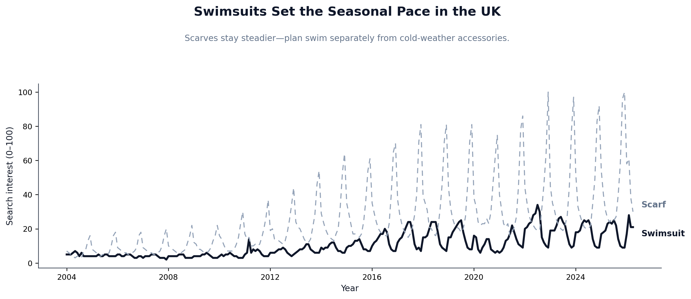
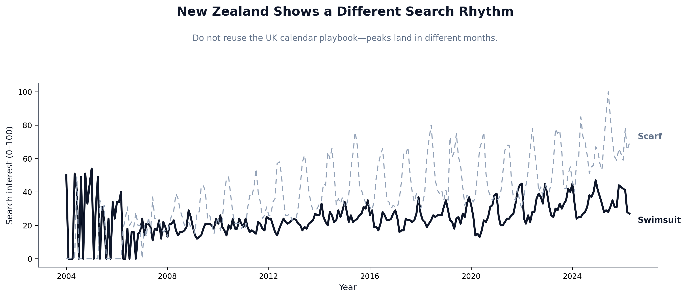
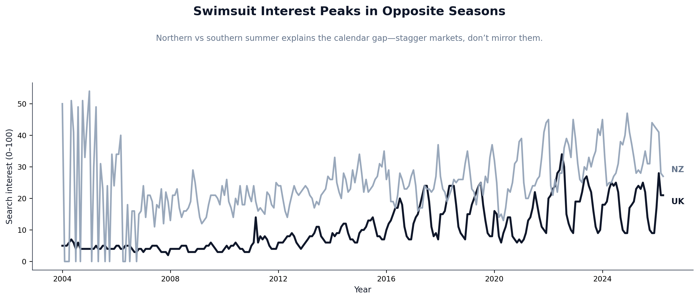
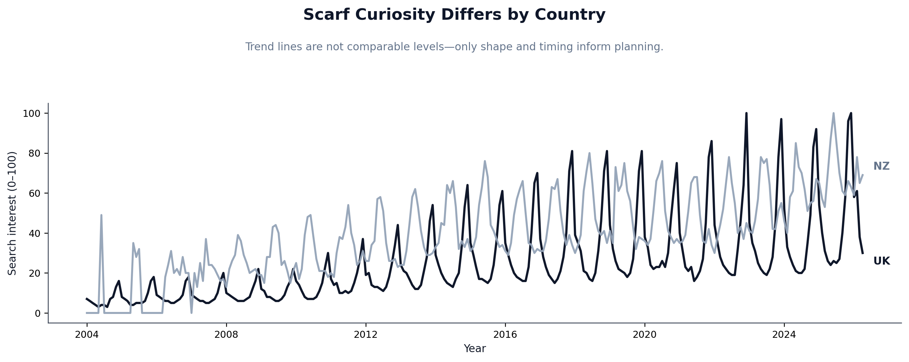
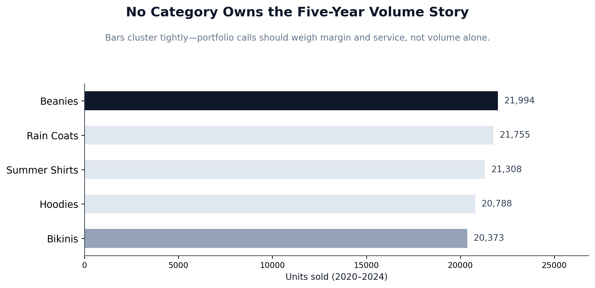
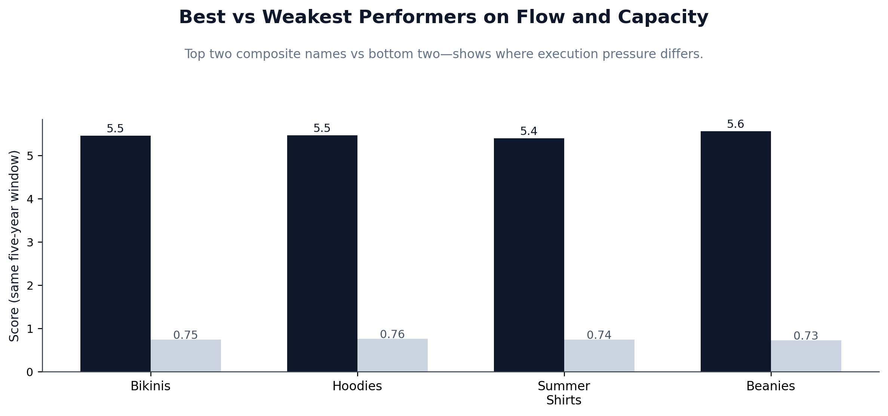
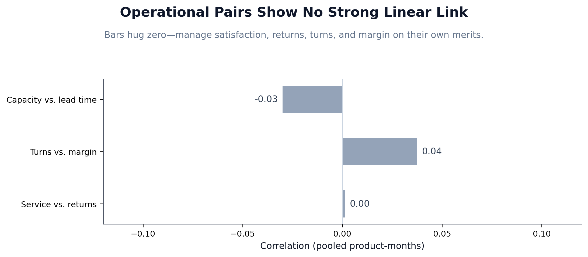

# FabricCo Market & Portfolio Analysis

**Course:** ISYS 814 — Strategic IT | SFSU MBA | Team C  
**Stack:** Python · pandas · matplotlib · openpyxl · Jupyter

---

## What This Is

FabricCo is a fashion manufacturer weighing whether to add dedicated swimsuit and scarf production lines. The question on the table: can two highly seasonal products sustain year-round manufacturing without constant line switching?

Two analyses. Google Trends data for the UK and New Zealand to map external demand timing. Then 20 years of internal KPI data across five product lines to figure out which products actually perform — and which ones just look like they do.

---

## The Short Answer

Year-round production is viable, but only if you treat UK and NZ as a sequenced pair rather than two separate problems. The hemisphere offset means demand peaks land roughly six months apart in each market for both products. One production line can serve both without a calendar gap.

Internally, volume is the wrong lens. All five products sell within 8% of each other on units. The differences that matter show up in margin, customer satisfaction, and returns — and those don't respond to company-wide fixes.

---

## Key Findings

**External (Google Trends)**
- UK scarves spike hard in Oct–Dec. NZ scarves mirror that in May–Jul. Same product, same risk profile, six months apart.
- Swimsuits are more forgiving — broader plateaus, less volatility. Scarves need tighter production timing.
- Pearson r between swimsuit and scarf interest: 0.146 (UK), 0.166 (NZ). Neither product predicts demand for the other.

**Internal (KPI Analysis, 2020–2024)**
- Five-year unit totals range from 20,373 to 21,994. Under 8% separates first from last. Volume doesn't differentiate this portfolio.
- Bikinis, Hoodies, and Rain Coats tie at composite rank 2.83 across six metrics. Beanies ranks last at 3.50.
- Beanies has the weakest margin (29.0%) and lowest customer satisfaction (8.41). That satisfaction gap has held for 20 years — not a service problem, a product problem.
- Three operational correlations (satisfaction vs. returns, turnover vs. margin, capacity vs. lead time) all land near zero. There's no single lever that moves outcomes across all product lines.

---

## Charts

**UK: Scarves vs. Swimsuits**  


**NZ: Scarves vs. Swimsuits**  


**Hemisphere Offset — Swimsuits**  


**Hemisphere Offset — Scarves**  


**Five-Year Volume (2020–2024)**  


**Composite 6-Metric Ranking**  


**Operational Correlations**  


---

## Repo Structure

```
fabricco-market-analysis/
├── FabricCo_Data_Challenge_Analysis.ipynb   # Full analysis notebook
├── build_analysis_package_xlsx.py           # Builds the Excel output from source data
├── FabricCo_Analysis_Package.xlsx           # Output: tables, correlations, embedded charts
├── DataChallenge1_Report_TeamC.pdf          # Final report submitted to Dr. Shahrasbi
└── charts/                                  # 11 chart PNGs at 240 dpi
```

---

## How to Run

```bash
pip install pandas matplotlib openpyxl jupyter

# Open the analysis notebook
jupyter notebook FabricCo_Data_Challenge_Analysis.ipynb

# Rebuild the Excel package
python3 build_analysis_package_xlsx.py
```

Source data files (`FabricCo_Full_Products_Corrected_KPIs_2004_2024.csv` and `UK_NZ_combined.xlsx`) are not included in this repo. The notebook, Excel package, and charts are the full output.

---

## A Note on the Excel File

The Excel file has no formulas. Every value — correlations, five-year aggregates, composite rankings, summary stats — is computed in `build_analysis_package_xlsx.py` and written via openpyxl. If a number looks wrong, the script is where to check it.
